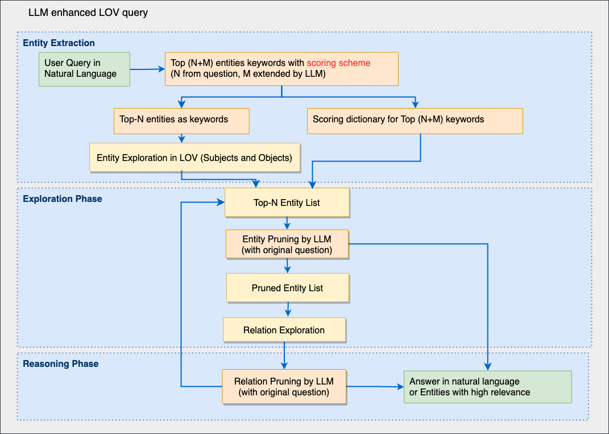

# Large Language Model Enhanced LOV Query Service

## Introduction

The Linking Open Vocabularies (LOV) project plays a vital role in the structured representation of data across the web. Our project enhances the LOV's query capabilities by integrating Large Language Models (LLMs), enabling natural language processing of queries and extending search relevancy with an adaptive scoring system. The outcome is a refined list of query results with minimal LOV interaction.

## Methodology

We utilize the LOV N-quad Ontology dataset to build a Knowledge Graph and interact with LLMs, specifically gpt-3.5-turbo. The RDFlib Python library handles the loading of data into memory, while our system leverages the LLM's reasoning to assess and score relevant concepts.

## Project Structure

./
├── LICENSE
├── README.md
├── config.ini
├── gpt_utils.py
├── kg_func.py
├── lov_main.py
├── lov_valid.nq
├── project_structure.txt
└── prompt_list.py


## Installation

First, ensure you have [Anaconda](https://www.anaconda.com/products/distribution) installed. Then, create and activate a new virtual environment:


```bash
conda create -n lov_query_env python=3.8
conda activate lov_query_env
```

Clone the repository:
```bash
git clone https://github.com/SAIL-UA/lov_llm.git
cd lov-llm
```

Install the required dependencies:

```bash
pip install -r requirements.txt
```

Usage
Run the main script to start the query service:

```bash
python lov_main.py
```
Follow the prompts to input your queries.

Architecture
To view the architecture of the project, see architecture.png in the repository.


